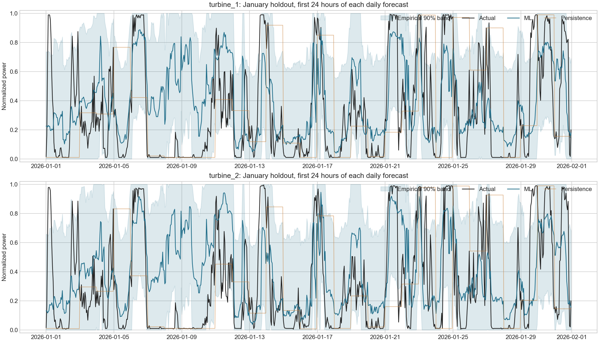

# Measured results

Independent January 2026 evaluation. Forecasts use archived GFS weather, never future SCADA weather. All metrics below are computed from saved prediction rows.

| Turbine | Persistence MAE | Model MAE | Model RMSE | Model R² | MAE improvement |
|---|---:|---:|---:|---:|---:|
| turbine_1 | 0.335164 | 0.246388 | 0.309170 | 0.156847 | 26.49% |
| turbine_2 | 0.332802 | 0.255451 | 0.320662 | 0.094980 | 23.24% |

Each turbine has 1,464 scored origin-target pairs and 744 unique January target hours. Overlapping forecasts are separate forecast decisions. The last 24 hours issued on January 31 fall in February and are excluded from January metrics.

## Interval coverage
Intervals target nominal 90% coverage using December residuals. Time dependence and distribution shift mean this is not a coverage guarantee.
- turbine_1: observed January coverage 88.11%.
- turbine_2: observed January coverage 87.84%.

## February replay
2,688 forecast rows, 56 daily runs, 48 hours each. No February actual power exists in the supplied files. `actual_power` and `error` are empty; MAE/RMSE/R² are null. Of these rows, 48 target hours lie beyond the February scoring period. After February 1, history is increasingly stale, not replaced by invented observations.

Files: metrics.json, validation_predictions.csv, backtest_predictions.csv, backtest_metrics.json.