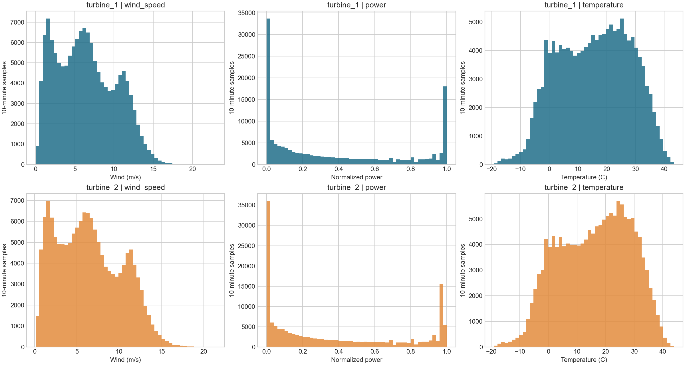
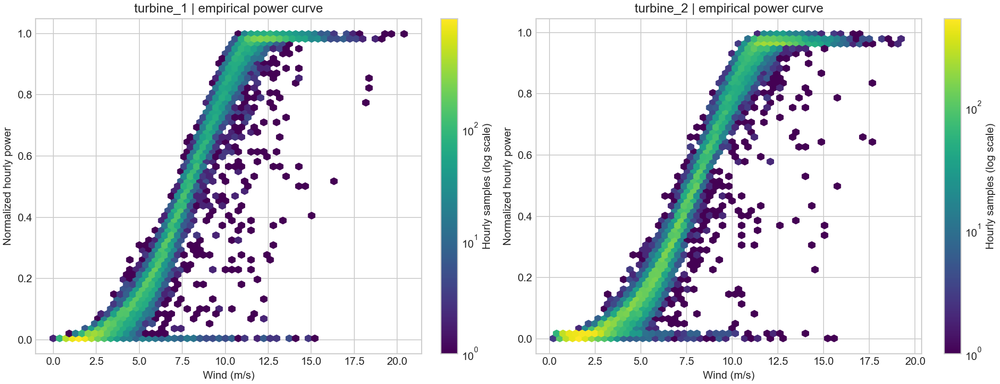
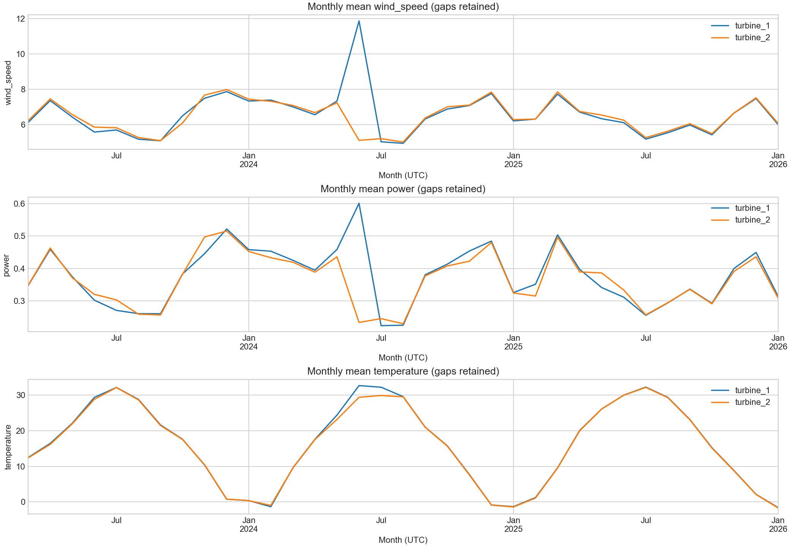
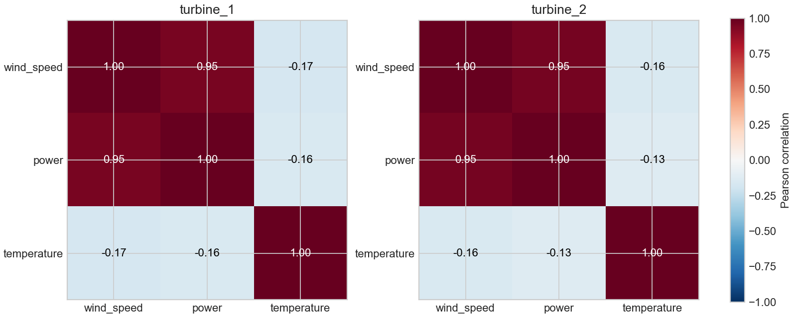

# Dataset audit

Timezone: fixed UTC+05:00 (confirmed by user). Files end **2026-01-31**, not February.
Hourly timestamps label interval starts; values become available at the end of the hour.

| Turbine | Raw rows | First / last local timestamp | Missing 10-min timestamps | Missing power hours |
|---|---:|---|---:|---:|
| turbine_1 | 142360 | 2023-03-11 00:00:00+05:00 / 2026-01-31 23:50:00+05:00 | 9992 | 1664 |
| turbine_2 | 149499 | 2023-03-11 00:00:00+05:00 / 2026-01-31 23:50:00+05:00 | 2853 | 473 |

## Cleaning decisions
UTF-8, comma separator, five original columns. ID is an identifier, not a feature. No duplicate timestamps or explicit nulls in the supplied files.
Missing timestamps are real gaps, not zero production. Hourly means require at least four distinct valid 10-minute readings. Targets remain missing when coverage is insufficient; no interpolation, backfill or fabricated labels.
Invalid cells (power outside [0,1], wind outside [0,75], temperature outside [-80,60]) become missing and are counted in report.json. Low production in strong wind may mean downtime/curtailment and is retained. Duplicates, if added later, are averaged per timestamp before resampling.
All origin lag/rolling features use only complete past hours. HistGradientBoosting handles missing feature values. Missing training targets are excluded explicitly.

## Figures

Full ranges, quantiles, correlations, step counts, anomaly counts and SHA-256 fingerprints: [report.json](report.json).